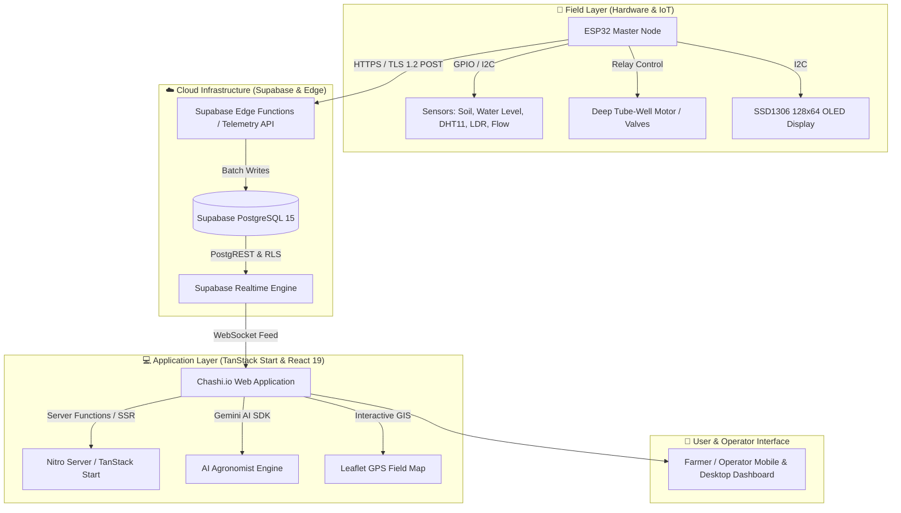

<p align="center">
  
</p>

<h1 align="center">🌾 Chashi.io — Smart IoT & AI Precision Agriculture</h1>

<p align="center">
  <strong>An Intelligent IoT & AI-Driven Precision Irrigation, Multi-Zone Water Distribution, and Agronomy Platform</strong><br>
  <em>Revolutionizing Agriculture & BMDA (Barind Multipurpose Development Authority) Irrigation Systems</em>
</p>

<p align="center">
  <a href="https://github.com/Mehedi-dev26/Chashi-io"></a>
  <a href="#"></a>
  <a href="#"></a>
  <a href="#"></a>
  <a href="#"></a>
  <a href="#"></a>
  <a href="#"></a>
</p>

---

## 📖 Table of Contents

- [🌟 Overview & Vision](#-overview--vision)
- [⚡ Key Features](#-key-features)
- [🏗️ System Architecture](#️-system-architecture)
- [📊 Impact & Benefits](#-impact--benefits)
- [🛠️ Tech Stack & Hardware](#️-tech-stack--hardware)
- [🛰️ IoT Firmware & Telemetry](#️-iot-firmware--telemetry)
- [🚀 Quick Start & Installation](#-quick-start--installation)
- [⚙️ Environment Configuration](#️-environment-configuration)
- [👨‍💻 About the Developer](#-about-the-developer)
- [📜 License & Acknowledgements](#-license--acknowledgements)

---

## 🌟 Overview & Vision

**Chashi.io** is a cutting-edge **AgriTech & IoT solution** engineered to modernize traditional deep tube-well irrigation networks (such as the Barind Multipurpose Development Authority - BMDA in Bangladesh) into fully automated, smart, and remotely controlled agricultural ecosystems.

Farmers and agricultural operators can visualize multi-zone farm topography via interactive GPS mapping, automate pump and solenoid valve switching based on live soil moisture/water levels, analyze historical telemetry trends, and receive AI-backed crop health insights directly from mobile or desktop devices.

```
                  ┌──────────────────────────────────────────────┐
                  │                 Chashi.io                    │
                  │   Smart Precision Agriculture Cloud Platform │
                  └──────────────────────┬───────────────────────┘
                                         │
            ┌────────────────────────────┼────────────────────────────┐
            ▼                            ▼                            ▼
   🛰️ Real-Time Telemetry        🗺️ GPS Pipeline & GIS         🤖 AI Crop Consultant
   Soil, Water, Temp, Flow     Multi-Zone Valve Mapping      Automated Agronomy Advice
```

---

## ⚡ Key Features

### 🚰 1. Remote Multi-Zone Motor & Valve Automation
* **Master Pump House Control:** Turn 3-phase deep tube-wells and booster pumps ON/OFF remotely with milli-second latency.
* **Smart Valve Actuation:** Direct water lines specifically to designated field zones (e.g., Zone A: Rice, Zone B: Wheat, Zone C: Mustard) to eliminate water wastage.
* **Fail-Safe Watchdog:** Integrated hardware heartbeat auto-cuts pump power if network or sensor connection is interrupted.

### 📡 2. Real-Time Telemetry & Sensor Analytics
* **Continuous Multi-Sensor Reading:** Live data streaming for Soil Moisture (%), Water Reservoir Level (cm), Ambient Temperature & Humidity (DHT11/22), LDR Sunlight Intensity, and Water Flow Rate (LPM).
* **Power & Energy Monitoring:** Tracks operational voltage, current draw, and power consumption with automated billing calculations.
* **Historical Logging & Charts:** High-performance interactive visual telemetry charts using **Recharts**.

### 🗺️ 3. Interactive GIS & GPS Satellite Mapping
* **Leaflet & OpenStreetMap Integration:** Custom interactive polygon drawing to demarcate agricultural plots, pipelines, valves, and motor nodes.
* **Satellite & NDVI Layers:** High-resolution satellite imagery with NDVI vegetative index tracking.

### 🤖 4. AI-Powered Agronomist & Disease Detection
* **Conversational AI Consultant:** Context-aware AI agronomist providing instant crop recommendations, fertilizer schedules, and pest mitigation advice.
* **Weather-Adaptive Irrigation:** Forecast-integrated watering suggestions based on impending rainfall and evapotranspiration rates.

---

## 🏗️ System Architecture



---

## 📊 Impact & Benefits

| Metric | Traditional Irrigation | With Chashi.io System | Improvement |
| :--- | :--- | :--- | :--- |
| **Water Usage** | Flooding / Over-irrigation | Targeted Sensor-Based Flow | **💧 40% - 50% Water Saved** |
| **Electricity & Fuel Cost** | Manual unmonitored pump run | Timed & Auto-Cutoff Operation | **⚡ 30% - 35% Energy Saved** |
| **Labor & Physical Visits** | Frequent on-site checks | 24/7 Mobile Dashboard | **⏱️ 80% Time & Labor Saved** |
| **Crop Yield Optimization** | Prone to root-rot or drought | Optimal Moisture Maintenance | **🌾 15% - 25% Higher Yield** |

---

## 🛠️ Tech Stack & Hardware

### 💻 Frontend & Full-Stack Web
* **Framework:** [TanStack Start](https://tanstack.com/start) + [React 19](https://react.dev/) (Full-stack SSR / Server Functions)
* **Routing:** [TanStack Router](https://tanstack.com/router) with strict type safety
* **Styling & UI:** [Tailwind CSS v4](https://tailwindcss.com/), [Radix UI Primitives](https://www.radix-ui.com/), [Lucide React Icons](https://lucide.dev/)
* **Data Visualization:** [Recharts](https://recharts.org/)
* **Geospatial Mapping:** [Leaflet](https://leafletjs.com/) & [React-Leaflet](https://react-leaflet.js.org/)
* **State & Server Cache:** [TanStack Query v5](https://tanstack.com/query)

### 🗄️ Backend & Cloud Database
* **Database:** [Supabase](https://supabase.com/) (PostgreSQL 15+ with Row Level Security & RBAC)
* **Realtime Subscriptions:** WebSockets via Supabase Realtime for instant sensor updates
* **Edge Functions & API:** TypeScript REST & Edge Microservices
* **Deployment:** [Vercel](https://vercel.com/) with global edge caching

### 🔌 Embedded Hardware & Firmware
* **Microcontroller:** ESP32-WROOM-32 / ESP8266 Dev Modules
* **Sensors:** Capacitive Soil Moisture Sensor v1.2, HC-SR04 Ultrasonic Distance, DHT11 / DHT22, LDR Photocell, YF-S201 Water Flow Sensor
* **Actuators:** Optocoupler Isolated 5V/12V Relay Modules, 12V Solenoid Water Valves
* **Display:** 0.96" I2C SSD1306 OLED (128x64)
* **Protocol:** HTTPS / TLS 1.2 JSON Telemetry Transport with fail-safe watchdog

---

## 🛰️ IoT Firmware & Telemetry

The embedded firmware is located in the [`device-firmware/esp32_bmda.ino`](file:///c:/Users/workp/OneDrive/Desktop/Iot/Chashi-io/device-firmware/esp32_bmda.ino) directory.

### Sample Telemetry Payload Structure (JSON)
```json
{
  "device_id": "MASTER-01",
  "zone_id": "PUMP-HOUSE",
  "soil_moisture": 68.5,
  "water_level": 82.0,
  "temperature": 29.4,
  "humidity": 74.0,
  "ldr": 850,
  "motor_on": true,
  "valve_open": true,
  "flow_lpm": 2.1,
  "voltage": 220.5,
  "current": 4.8,
  "rssi": -62
}
```

---

## 🚀 Quick Start & Installation

### Prerequisites
* **Node.js**: `v20.x` or `v22.x+`
* **Package Manager**: `npm` or `bun`
* **Arduino IDE**: (For flashing firmware to ESP32 devices)

### 1. Clone the Repository
```bash
git clone https://github.com/Mehedi-dev26/Chashi-io.git
cd Chashi-io
```

### 2. Install Dependencies
```bash
npm install
```

### 3. Setup Environment Variables
Create a `.env` file in the root directory:
```env
SUPABASE_URL="https://your-project.supabase.co"
SUPABASE_PUBLISHABLE_KEY="your-anon-key"
SUPABASE_SERVICE_ROLE_KEY="your-service-role-key"

VITE_SUPABASE_URL="https://your-project.supabase.co"
VITE_SUPABASE_PUBLISHABLE_KEY="your-anon-key"
```

### 4. Setup Supabase Database Schema
Run the provided idempotent SQL setup file in your Supabase SQL Editor:
* Execute [`supabase/complete_backend_setup.sql`](file:///c:/Users/workp/OneDrive/Desktop/Iot/Chashi-io/supabase/complete_backend_setup.sql)

### 5. Run Development Server
```bash
npm run dev
```
Open [http://localhost:3000](http://localhost:3000) in your browser.

### 6. Production Build
```bash
npm run build
```

---

## 👨‍💻 About the Developer

<p align="center">
  
</p>

<h3 align="center">Mehedi Hasan</h3>
<p align="center">
  <strong>Full-Stack Software Engineer & IoT / Embedded Systems Architect</strong><br>
  <em>Specializing in Modern Web Ecosystems (React, Next.js, TanStack), Cloud Backends, and Smart IoT Solutions</em>
</p>

<p align="center">
  <a href="https://github.com/Mehedi-dev26"></a>
  <a href="mailto:mehediworkpc@gmail.com"></a>
  <a href="https://github.com/Mehedi-dev26"></a>
</p>

---

## 📜 License & Acknowledgements

This project is licensed under the **MIT License** — feel free to use, modify, and distribute for educational, research, and commercial applications.

* Special appreciation to the **Barind Multipurpose Development Authority (BMDA)** inspiration for smart irrigation in northern Bangladesh.
* Built with modern engineering using **TanStack**, **React**, **Supabase**, and **Espressif Systems**.

<p align="center">
  Made with ❤️ by <strong>Mehedi Hasan</strong> | Powered by <strong>Chashi.io</strong>
</p>
